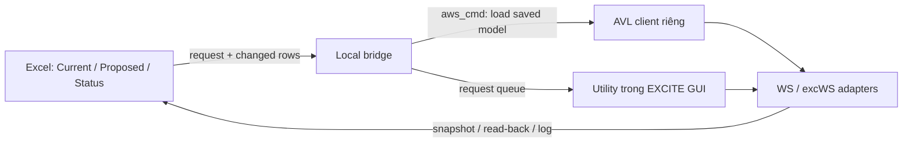

# Nghiên cứu dashboard Excel kiểm tra và Apply setting EXCITE

Ngày: 2026-10-04 (Asia/Tokyo). Nguồn nghiên cứu: AVL cài trên máy người dùng.

## Kết luận

Có thể tạo dashboard Excel để đọc, so sánh, kiểm tra và gửi thay đổi sang EXCITE qua một bridge chạy local. Bề mặt API đã xác nhận đủ để bắt đầu với global/case/element named parameters, crank-train và solver scalar settings. Load Data, bearing và Timing Drive có schema/API rõ ở nhiều phần nhưng cần adapter theo loại object, unit, active branch và model thực tế. Chưa có thử nghiệm ghi/SaveAs/read-back nào trong nghiên cứu này; chưa có dashboard Apply hoạt động được bàn giao.

Không có căn cứ để đưa tỷ lệ “điều khiển được 80%/100% settings”. Số field trong schema bao gồm template, các loại element khác nhau và nhánh không active. Phạm vi chính xác phải đo trên model/phiên/version cần dùng.

## Các file chỉ mục

- `EXCITE_CONTROL_INDEX.csv`: 193 mục chính gồm API surfaces và settings ưu tiên. Một dòng có thể là một scalar, bảng, nhóm getters hoặc một field schema. Đây không phải 193 phép ghi đã chạy thành công.
- `EXCITE_SCHEMA_CANDIDATES.csv`: 1.388 khai báo field có nhãn, trích từ 24 file header ASE của Power Unit/Timing Drive. Đây là danh mục tra cứu schema có điều kiện, không phải danh sách field thực tế/active trong model đang mở. Một số mục trùng với chỉ mục chính; không cộng hai số này thành tổng số setting kiểm soát được.

Cả hai file dùng UTF-8 BOM, CRLF, comma delimiter và quoting. Có thể mở trực tiếp hoặc vào Excel → Data → From Text/CSV, chọn UTF-8 và delimiter comma. CSV không lưu filter, màu, công thức, nút hoặc macro của dashboard.

Những cột nên xem trước: `product`, `group`, `setting`, `field_path`, `read_evidence`, `write_evidence`, `apply_status`. `source/source_line` cho phép tra implementation/schema gốc. Với các dòng schema, `field_path` mới là **field token**, chưa phải full nested path; `class_or_api` là class khai báo, chưa phải instance đang mở. Các biểu thức có `Candidate:` hoặc placeholder là hướng adapter, không phải code chạy trực tiếp.

`sample_value` chỉ là giá trị từ `simple_body.ex` hoặc field tồn tại trong file mẫu. Xem `read_evidence` để biết giá trị đã đọc qua API hay mới được thấy trong file. Không coi default trong header là current value của model người dùng.

## Kiểm chứng runtime đã bổ sung

Đọc bằng `aws_cmd.exe` + `probe_ex_utilities_readonly.py` trong một hidden client riêng, load file đã lưu. Phiên GUI người dùng và thay đổi chưa lưu không được khảo sát bởi phép thử này.

| Setting/đối tượng | Kết quả |
|---|---|
| Speed | 2000 rpm |
| Bore / stroke / rod length | 0.1 / 0.1 / 0.2 m |
| Solver timestep / min / max | 1e-6 / 1e-8 / 1e-5 s |
| Effective simulation range | 0–1440 deg, 0–0.12 s |
| Results Control | ANGR, STORED, increment 1, vertical axis code 3 |
| Cylinder-pressure peak-search width | 60 deg qua `Load/load → cylpressdata.peakSearchWidth` |
| Load case class list | 1 entry qua `Load/load → loadcases.loadcase` |
| Body inertia matrix | kích thước 3×3 qua `element.GetClass() → bdefine.it`; chưa đọc cell/unit |
| Speed parameter binding | `GetAssignedParameter('general.speed')` trả null |
| Model graph | Crankshaft1, ROTx_1, 1 đường nối |

21 dòng trong CSV chính mang nhãn Runtime read verified; không phải toàn bộ các phép thử runtime được liệt kê thành mỗi một dòng CSV. Không có field nào được đánh dấu write-roundtrip verified. Các getter body references đã chạy nhưng trả giá trị rỗng trên mẫu. Model không có HD/AXHD bearing hay Timing Drive native để thử những adapter đó.

AVL có cảnh báo TypeError bị ignored trong quá trình load; probe cuối hoàn tất exit code 0 và các checks trả ok. Một lần thử ClassList gặp lỗi do docstring nói ReleaseHandle nhưng wrapper thực tế dùng `WSClassList.Release()`. Đã sửa probe và chạy lại thành công. WSMatrix/WSMap dùng `ReleaseHandle()`. Đây là ví dụ cần đối chiếu implementation đúng release trước khi viết bridge.

## Load Data: kiểm soát được đến đâu?

`Model.GetClass('Load','load')` là root chính thức. Header `AWS/appl/clients/excite/res/cpp/newloadgen.h` mô tả cấu trúc.

| Phần | Settings cần đưa lên Excel | Cách xử lý | Bằng chứng/giới hạn |
|---|---|---|---|
| Cylinder pressure | speed, angle/pressure table, file, pressure factor/shift, cyclic shift, reload flags | WSClass typed getter/setter; WSMatrix cho bảng; resolve pressure object trong class lists | Schema rõ; mới test peak-search scalar, chưa import/ghi pressure table |
| Load item | force/moment/acceleration/harmonics mode, input table/file, make periodic, scale/shift/rotation | Adapter theo loại load, chọn đúng data/data_harmonics và đơn vị từng cột | Schema rõ; mode/enable/dependency phải xét; không chỉ sửa file path |
| Load case | pressure assignment, reference system/speed, gravity, run-up, speed-vs-time/angle, resampling | Class-list traversal + scalar/matrix APIs | Đã test count class list; chưa resolve mọi loadcase subtree |
| Active Load Case | selected case và parameter-controlled selection | Xét activecase/UUID selector/use_param | Khác với Workspace case set/Case 1; không dùng nhầm SetCaseParameter để quản lý toàn bộ Load Data |
| Timing Drive Link | model path/name/case, link enable, rotation matrix, coupling | Power Unit Load Data adapter | Schema xác nhận; chọn file/case phải xét dữ liệu ngoài `.ex` |

Ví dụ dùng `GetWSClassList('loadcases.loadcase')` để duyệt instance, `GetClass(index)` để lấy từng class rồi mới truy cập field/subclasses. Không dựa vào tên hiển thị “New Load Case” để chọn object duy nhất. Field như `trans.yfac` nằm trong struct, không phải root `yfac`; CSV schema không tự suy ra nesting.

Thay đổi pressure/load table có thể cần bật flags hoặc reload/recalculate để effective data cập nhật. Việc sửa path không chứng minh file dữ liệu đã được load. Bridge phải read-back dữ liệu effective và kiểm tra file tồn tại, cột/unit, ordering/periodicity theo loại load.

## Bearing: các nhóm cần có adapter

Có getter riêng `excHDJoint.get_HD_grid_data`, `get_AXHD_bearing_data`, `get_profiles`, `get_summit_roughness`, `get_layer_thickness_and_conductivity_parameters`, `get_requested_wear_calc`. Có các writer chính thức cho một số workflow như `add_profile`, `set_wear_calc`; WSClass typed setters còn cho phép ghi field theo path đã biết.

Có thể xây dashboard theo từng loại bearing cho radius/width/clearance, HD grid, body IDs, vị trí/hướng, oil/thermal, profiles, roughness và wear. Getter trả dữ liệu không tự chứng minh mọi thành viên dict có một setter đối xứng. Hiện chỉ xác nhận từ implementation; phải thử trên model HD/AXHD thực tế và hiểu selector/units trước khi cho Apply.

`bearing.h` còn chứa các field tính clearance/tolerance/thermal expansion. Đây có thể là utility tính toán geometry, không đồng nhất với bearing joint effective clearance của solver. CSV tách `Bearing clearance tool` khỏi `Bearing HD/AXHD`. Rolling bearing settings cũng là nhóm riêng.

## Timing Drive: hai phạm vi khác nhau

1. **Timing Drive Link trong Power Unit:** `TimingDrive` dưới Load Data chứa `useTDlsets`, `modelpath`, `model`, `case`, `rmat`, `coupling`. Link tới model/dữ liệu bên ngoài; model `.ex` không chứa toàn bộ thông số chain/belt của model liên kết.
2. **Timing Drive native:** `WS.GetTyconClient(instance_name)` được wrapper mô tả trực tiếp là EXCITE Timing Drive. Cần client/model `tycon` riêng để đọc/ghi chain/belt/tensioner/pulley/cam. Không gắn API Power Unit với những object này tùy tiện.

Các header xác nhận field candidates: Chain/TBelt number of links/teeth, pretension, nominal pitch, axial offset; Bten stiffness/damping/preload/deflection range; Srbs bearing stiffness/damping/viscosity/relative clearance/diameter ratio; Sabs/Trbe axial/roller bearing settings. Dùng CSV mở rộng để tra nhóm stiffness, mass, geometry và nominal motion.

`AWS/python/clients/tycon/timing_definition.py` có workflow thật dùng `WSInOutStack` và `DoAction('set-firing-angles')`, `DoAction('set-start-angles')`. Có cơ sở để làm adapter cam timing, nhưng đây là command protocol nội bộ với UUID, rotation direction và unit context; chưa test runtime. Một số Timing Drive object là ACT nên cần xác nhận `IsACT()`/`GetACTObject()` và edit transaction/commit; candidate ASE getter không chắc áp dụng cho ACT object của model thực tế.

## Excel dashboard khả thi

Dashboard nên có bộ lọc product/model/case/object/group, Current/Proposed/Read-back/Unit/Status và nút Refresh, Check, Preview Changes, Apply to Copy. Separate source snapshot giữ current values để refresh không xóa proposed edits. Các bảng pressure/load nên có editor dạng table và chart xem curve; không ép toàn bộ matrix vào một ô.

| Chức năng | Khả năng hiện tại |
|---|---|
| Import CSV, filter/group, tìm setting, so sánh model snapshots | Làm được bằng Excel thông thường/Power Query |
| Refresh từ file `.ex` đã lưu | Đã chứng minh backend `aws_cmd` đọc model; cần đóng gói export và nối Excel |
| Check datatype, unit, min/max do schema xác nhận, thiếu file, object UUID, duplicate keys, stale snapshot | Làm được trong bridge/Excel; rule phải khai báo theo field |
| Check toàn bộ tính đúng của solver/model | Chưa chứng minh; không thay thế AVL model validation hay simulation |
| Apply global/case/element named parameters | Setter có thật; cần validate/write/read-back/reopen test |
| Apply crank-train/solver scalar | Có field paths và read runtime; cần round-trip test write |
| Apply Load Data curves/bearing/Timing Drive | Khả thi theo adapter từng nhóm; chưa có mapping đầy đủ hoặc runtime write |
| Đọc/Apply đúng phiên EXCITE đang mở, gồm unsaved edits | `WS.GetActiveClient()` trong GUI utility đã có nền tảng; external Excel → GUI command bridge cần triển khai/test |
| Edit bất kỳ setting GUI không cần schema | Chưa có cơ sở hỗ trợ |
| Force/moment/pressure/wear history kết quả | Cần đọc `.gid`/result files; không coi `.ex` là kho chứa solver time series |

## Kiến trúc đề xuất

Nhánh batch phù hợp cho MVP: Excel gọi process local, AVL runtime load một file `.ex` đã lưu, xuất snapshot hoặc Apply lên bản sao rồi trả kết quả. Không tự attach external `aws_cmd` bằng `GetActiveClient()` và giả định nó là GUI client của người dùng: active client là context trong runtime đang chạy, không phải một COM ProgID đã xác nhận.

Nhánh live: giữ utility bên trong EXCITE để `WS.GetActiveClient()` truy cập đúng model unsaved. Utility đọc request do Excel gửi qua file queue (JSON/CSV) và xử lý trên luồng/runtime của GUI, trả response cùng request ID. Cần kiểm chứng timer/GUI scheduling của AVL trước khi triển khai; không gọi WS native bridge tùy tiện từ background thread. Có thể bắt đầu bằng nút Import Requests trong utility để đơn giản hóa.

Excel desktop VBA có `Shell` để gọi một executable local, nhưng Shell chạy bất đồng bộ; dashboard phải nhận job/request ID và đợi response đúng thay vì refresh ngay. Power Query có Text/CSV import để đưa snapshot vào worksheet. Đây là các building block được Microsoft hỗ trợ, chưa chứng minh workflow end-to-end với workbook cụ thể trên máy này. CSV-only read/check dùng được trước; `.xlsm` + VBA/local bridge hoặc add-in local có thể thêm Apply sau.

**Python in Excel `=PY()` không phù hợp để làm AVL bridge**: Microsoft xác nhận nó chạy trong cloud container, không truy cập máy người dùng và không có network access. Python local và runtime Python của AVL là môi trường khác. Vì vậy dùng `.xlsx`/`.xlsm` làm giao diện và process local làm controller.

Nguồn Microsoft: [Python in Excel security](https://support.microsoft.com/en-au/excel/python/data-security-and-python-in-excel), [VBA Shell](https://learn.microsoft.com/en-us/office/vba/language/reference/user-interface-help/shell-function), [Power Query Text/CSV](https://learn.microsoft.com/en-us/power-query/connectors/text-csv). Nguồn AVL là source/schema tại các path trong CSV; tài liệu web của EXCITE M release mới không thay thế API Power Unit.

## Định danh và giao thức Apply

Mỗi row cần có `mapping_id`, product/client, version, model fingerprint, snapshot timestamp, object UUID, class/instance path, field path hoặc parameter name, case set/case, value kind, unit key, current raw/evaluated value, proposed value, binding, active condition và write eligibility. Rows bảng cần table ID + row/column + unit metadata; không dùng tọa độ Excel làm identity.

Refresh cần giữ Proposed theo stable mapping ID. Check/Preview cần báo Missing/Inactive/Unsupported/Changed since snapshot. Null, INF, zero và blank khác nhau; không chuyển tất cả thành 0. Expression và parameter binding phải được giữ hoặc sửa có chủ đích; tránh ghi numeric value trực tiếp đè lên field đang bind với parameter.

Apply workflow: đọc request → chọn đúng client/model/case/object → xác nhận fingerprint/current value vẫn khớp → validate từng thay đổi → tạo bản sao/output path → setter được allowlist → read-back trong memory → SaveAsModel ra file riêng → load lại output trong client riêng → so sánh và trả audit. Nếu lỗi giữa batch, chưa xác nhận API transaction/rollback tổng quát của WS; phải bỏ bản copy lỗi và báo partial failure, không tự lưu đè source. Live branch cần xử lý transaction riêng theo object ACT/ASE.

Không dùng string `eval()` của cột read_api/write_api. CSV này là research index; bridge dùng adapter functions và mapping allowlist đã kiểm thử. Check đánh giá giá trị/schema và sự nhất quán; solver validation là một action riêng khi API tương ứng đã được xác minh.

## Lộ trình triển khai theo phạm vi đã chứng minh

1. **MVP đọc/check:** Refresh từ saved `.ex`; current snapshot có parameters, speed, solver, results, topology. Excel filter, proposed values, preview diff; Apply chưa bật.
2. **Apply scalar trên copy:** chọn speed và timestep rồi global/case/element parameters. Kiểm thử write→read→save→reopen trước khi mở rộng allowlist.
3. **Load Data:** duyệt actual loadcases/pressure/loaditems, full paths, curve tables, activation/binding, external-file reload. Kiểm thử profile curve và sample loadcase thật.
4. **Bearing:** dùng model HD/AXHD/rolling-bearing để build adapter theo type và test unit/geometry/grid/profile/wear.
5. **Timing Drive:** kết nối model `tycon` riêng, xác nhận ASE/ACT và timing commands; sau đó nối Power Unit link nếu cần.
6. **Live GUI:** request bridge tới utility trong phiên đang mở, xử lý conflict giữa Excel proposed edits và GUI unsaved changes.

Sản phẩm của lượt này là hai CSV chỉ mục, báo cáo khả thi và read-only probe được mở rộng. Dashboard/VBA/local request queue và Apply adapter chưa được triển khai.
